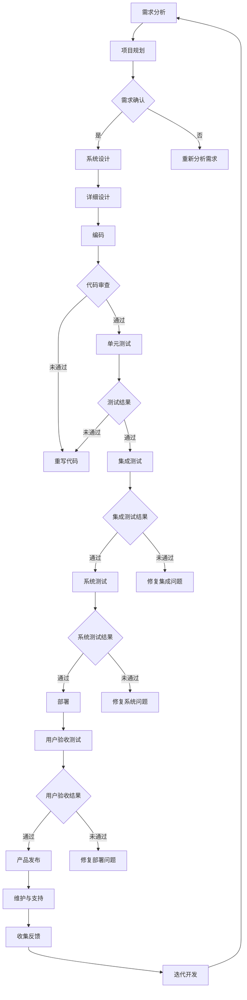

```mermaid
graph TD
    A[需求分析] --> B[项目规划]
    B --> C{需求确认}
    C -->|是| D[系统设计]
    C -->|否| C1[重新分析需求]
    D --> E[详细设计]
    E --> F[编码]
    F --> G{代码审查}
    G -->|通过| H[单元测试]
    G -->|未通过| F1[重写代码]
    H --> I{测试结果}
    I -->|通过| J[集成测试]
    I -->|未通过| F1
    J --> K{集成测试结果}
    K -->|通过| L[系统测试]
    K -->|未通过| J1[修复集成问题]
    L --> M{系统测试结果}
    M -->|通过| N[部署]
    M -->|未通过| L1[修复系统问题]
    N --> O[用户验收测试]
    O --> P{用户验收结果}
    P -->|通过| Q[产品发布]
    P -->|未通过| N1[修复部署问题]
    Q --> R[维护与支持]
    R --> S[收集反馈]
    S --> T[迭代开发]
    T --> A
```